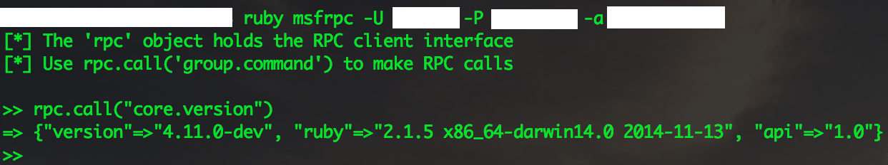
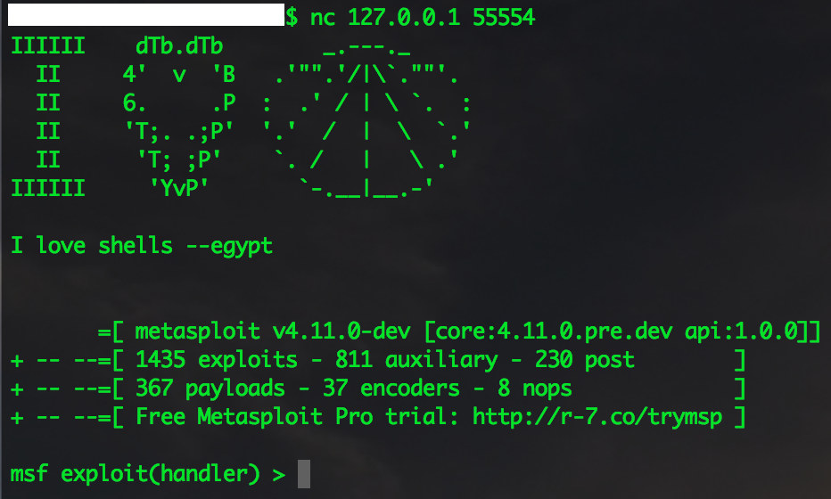

% Metasploit as a service

Metasploit Framework can be run as a service and used remotely. The main advantage of being able to use Metasploit remotely is that you can control it with your custom security scripts. Or control it from anywhere in the world from any device, as long it has a Terminal and supports Ruby. However, the local Metasploit is the most convenient.

## RPC service

The current RPC APIs allow you to do basic tasks such as managing the database, the sessions, modules, etc. There are two ways to start the RPC service:

1.  Using the msfrpcd utility
**$ ruby msfrpcd -U USERNAME -P PASSWORD -f**

2.  Using the msgrpc plugin
	1. Start `msfconsole`
	2. `load msgrpc`
	3. It will tell you all the necessary login information

To connect to it, there are also two ways:

1.  On the client-side, if your device already has Metasploit Framework, then you can use the msfrpc utility to connect to the service:
`ruby msfrpc -U USERNAME -P PASS -a IP`

2.  If you don’t have Metasploit Framework, then you need to at least have Ruby 2.x with rvm. And then you can download/install the msfrpc-client gem and use it:
	1.  `gem install msfrpc-client`
	2.  `cd gem env gemdir/gems/msfrpc-client-[tab]/examples`
	3.  `ruby ./msfrpc_irb.rb --rpc-user [USER] --rpc-pass [PASS] --rpc-port 50505 --rpc-token [API KEY] --rpc-ssl false`

A successful connection should be like the following example:

> To see all the RPC API calls visit, [https://rapid7.github.io/metasploit-framework/api/Msf/RPC.html]( https://rapid7.github.io/metasploit-framework/api/Msf/RPC.html).

## Daemon

To start Metasploit as a daemon, run the msfd utility (this will open up port 55554 by default):

`$ ruby msfd -a 0.0.0.0`

To connect to it,use netcat like the following example:

## Local Instance

Just use `msfconsole`.