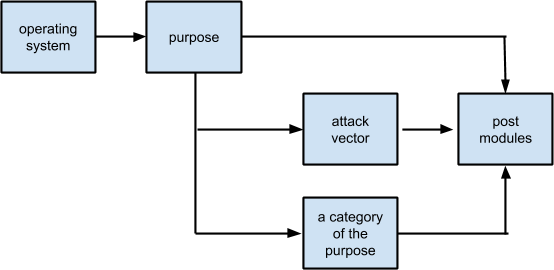

% Use exploits


Exploits are programs that take advantage of software flaws (vulnerabilities) to achieve unintended results such as arbitrary code execution, privilege escalation, denial-of-service, information disclosure, etc. However, the definition of an exploit is much more strict with Metasploit: it’s a Ruby script that gives you a shell. 

To load an exploit type “use” in the terminal. For example:

```bash
msf > use exploit/windows/smb/ms08_067_netapi
msf > exploit(ms08_067_netapi) >
```

After an exploit is loaded, you also need to set all the required options. To find out what options are required, you can use the `show missing` command. And then you can use either the `run` or `exploit` command to start the exploit.

## Limitations of an exploit

Unlike regular programs, most exploits are application-specific (requirements), and they probably have side-effects on the target machine (for example: DOSing the service or even the machine). It would help if you thought about that before hitting the exploit against a real target.

> Get Metasploitable3 [https://github.com/rapid7/metasploitable3](https://github.com/rapid7/metasploitable3)

## Exploitable requirements

One primary type of requirement is that **most exploits are version-specific**. As a software developer, sometimes we create new bugs or vulnerabilities when new features are released, or when new patches are applied, and your exploit will only work if the buggy code actually exists (and reachable). Take `ms14_012_textrange` for example, this is an exploit for Internet Explorer 9, but it only works against IE9s that were built between July 2013 to February 2014. So if you were to use this exploit, you would have to know the exact MSHTML build your target is using. Luckily, the ms14_012 module is capable of checking this automatically.

The `check` command can help to determine if your targets are vulnerable, or no. Not all modules support the check command, but for the ones that do, you can tell it to check for a range of hosts:


If something is being flagged as vulnerable, it means the check function triggered the buggy code and picked up the vulnerable symptoms. If the check says “Appears,” then it just means the target looks vulnerable through passive surveillance. “Cannot reliably check exploitability” basically means the module thinks the target is safe from exploitation.


Another type of requirement to understand is **vulnerability does not always equal to exploitability**, especially if the exploit depends on other environmental factors to achieve code execution. Years ago, if you found a memory corruption on SMB such as `ms08_067_netapi`, you would be able to exploit it because Windows had fewer mitigations. But today, if you find something similar on Windows 8, you will hit all kinds of memory protections such as GS, DEP, ASLR, SEH, SEHOP, more memory randomness. It’s challenging.

Other common exploitable requirements include:

- The use of a 3rd party DLL to bypass default mitigations
- The use of specific Windows APIs
- Appropriate permissions, such as on the file system and the application, etc. An example of this is abusing the PUT method in HTTP.
- Post-authentication: If you can’t figure out the password to trigger the vulnerable code, you’re not exploiting anything, are you?


The worst case that can happen for not meeting the exploitable requirements is crashing the target machine or causing permanent damage (bad data being stored).

Ideally, all this required information should be explained in the exploit’s metadata, which can be retrieved with the `info` command in msfconsole. If this isn’t well documented in the module, then you can try these approaches:

* [Github](https://github.com/rapid7/metasploit-framework/pulls?q=is%3Apr+is%3Aclosed): Before a Metasploit module is published, it goes through testing and code review as a [pull request](http://lmgtfy.com/?q=what+is+a+pull+request). Usually, this pull request documents setup requirements, vulnerability information, steps to test, limitations, real user feedback, etc.
* The `info` command also shows the Metasploit author’s name and maybe the contact information. You can try asking.
* Try it yourself against your own test machine.

## Corruption reliability

One of the most common types of vulnerabilities is memory corruption, so it’s worth learning about what it does for you. Memory corruptions are corrupt data in memory, in most cases, they result in crashes, but it’s also possible they can be so subtle you don’t even know it’s happening. We’ll focus on crashes because it’s easier to explain.

When an exploit is taking advantage of a memory corruption, what that means is it’s controlling that crash. When you’re able to control that crash, you’re controlling code execution. And of course, when you’re controlling code execution, you do whatever you want.

However, a crash is still a crash after all, so there are risks. Some exploits can control the crash extremely well and consistently get you a shell, some are always somewhat unstable at different stages due to various reasons. When you’re using an exploit, you need to keep this in mind.

The easiest way to find out about a Metasploit exploit’s reliability is from the ranking, and you can use the `info` command to find it. There are currently [seven different rankings](exploit-ranking.html) used by modules. Sometimes the exploit’s reliability is also mentioned in the module description.

## Payload support

Metasploit has a huge selection of payloads, but it’s up for the exploit to decide which ones are actually supported. To find out, after you choose an exploit, you can use the “show payloads” command to list all available payloads.

Meterpreter is the most popular type of payload for Metasploit. Practically speaking, if you are testing a Windows exploit, it’s better to use windows/meterpreter/reverse_tcp. If you’re on Linux, try `linux/meterpreter/reverse_tcp`. Always choose a native meterpreter first if you can, if not, if there’s a cross-platform one (such as `java/meterpreter/reverse_tcp`), then try that.

To manually select a payload for you exploit, here’s what you do:

```bash
set payload windows/meterpreter/reverse_tcp
```
If you’re feeling lazy, you don’t actually always have to manually select a payload. Msfconsole actually has its own preference list in the following order if nothing is selected by the user:

1. windows/meterpreter/reverse_tcp
2. java/meterpreter/reverse_tcp
3. php/meterpreter/reverse_tcp
4. php/meterpreter_reverse_tcp
5. ruby/shell_reverse_tcp
6. cmd/unix/interact
7. cmd/unix/reverse
8. cmd/unix/reverse_perl
9. cmd/unix/reverse_netcat_gaping
10. windows/meterpreter/reverse_nonx_tcp
11. windows/meterpreter/reverse_ord_tcp
12. windows/shell/reverse_tcp
13. generic/shell_reverse_tcp

## Post exploitation support

When an exploit successfully gives you a shell, you are under the context of the process you’re exploiting. Do I mean “under the context of the user?” Well, it used to be yes, but against modern systems, this may be more like a yes and no. Why is that?

When you get a shell, yes, you are under the context of the user. But depending on what process you’re exploiting, there may be more access control so you actually get less privileges to resources compare to the actual user. One example of this is [Internet Explorer’s Enhanced Protected Mode](https://docs.microsoft.com/en-us/archive/blogs/ie/enhanced-protected-mode). In that case, you will have to find another exploit to escalate your privileges.

Privilege escalation is considered a type of post-exploitation (but not as post modules). In Metasploit, whatever post-exploitation type modules you can use depend on what type of session you’re on. There is either a **meterpreter type session**, or a **shell session**, and Meterpreter has always been favored much more than Shell.

If you are stuck with a shell session, you can use the `post/multi/manage/shell_to_meterpreter` module to upgrade your shell to a meterpreter.

## The exploit tree

At this point, hopefully, you have learned everything I want you to know about exploits’ capabilities in general: from exploitable requirements, reliability, payload support, and post-exploitation support.

From here, we’ll talk about choosing an exploit. From browsing the exploit tree, to actually picking the most appropriate one. All exploits in Metasploit are placed under the “modules/exploits” directory, and roughly are organized this way (each box represents a directory):



So let’s say you want to pick an exploit for SMB, here’s what you can do in msfconsole:

```bash
msf > use exploit/windows/smb/[tab x 2]
```

When you hit the tab key twice, msfconsole will list all the smb exploits for me. And then you can tab-complete your way to pick an exploit.

Another way to search an exploit is with the `search` command. You can search using the following keywords:

| Name | Description |
| ---| ---|
| app| Modules that are client or server attacks |
| author| Modules written by this author |
| bid | Modules with a matching Bugtraq ID |
|cve | Modules with a matching CVE ID |
| edb | Modules with a matching Exploit-DB ID |
|name | Modules with a matching descriptive name | 
| osvdb| Modules with a matching OSVDB ID |
| platform| Modules affecting this platform |
| ref| Modules with a matching ref|
| type| Modules of a specific type (exploit, auxiliary, or post) |

An example of using the search command to achieve similar results as using the `use` command to find exploits:

```bash
msf > search type:exploit platform:win smb
```

## Choosing an exploit

The harsh reality about exploits is that once they’re publicly known, the effectiveness will eventually expire, and there is no guarantee if there will ever be a replacement for it. Not to mention exploits are typically build-specific. If you want to know what the most current and reliable exploits are, you pretty much have to force yourself to keep up with the news at all times. In reality, most people don’t have this kind of energy, so we vaguely rely on the following guidelines:

* Pick the latest: You can find out what the latest is by looking at each module’s disclosure date, or CVE number (if there’s one). The newer the date, the less likely the target machine is patched.
* Pick the highest-ranking first: Start with Excellent, because those exploits are safer to use. If there isn’t any, try Great, and then Good. Normal is kind of the minimum quality requirement, although occasionally there are exceptions.
* Less exploitable requirements: Simply because the more requirements, the harder it is being able to use the exploit.

As a quick reference, here are some of your first go-to exploits that are not so application-specific:

* **Remote**
  * exploit/windows/smb/psexec
  * exploit/windows/smb/psexec_psh
  * exploit/windows/smb/ms08_067_netapi
  * exploit/windows/smb/ms17_010_eternalblue
* **Client side**
  * exploit/windows/browser/ms13_037_svg_dashstyle (set target to 1)
  * exploit/windows/browser/ms14_064_ole_code_execution (no patch for XP, no powershell prompt for Win 7 SP0 with IE9, but above that there will be)
  * exploit/multi/browser/firefox_xpi_bootstrapped_addon
  * exploit/multi/browser/java_signed_applet
* **Local privilege escalation**
  * exploit/windows/local/ms14_058_track_popup_menu
  * auxiliary/admin/kerberos/ms14_068_kerberos_checksum + standalone mimikatz + exploit/windows/local/current_user_psexec (you can see how this is done in PR [#4456](https://github.com/rapid7/metasploit-framework/pull/4456))
  * exploit/windows/local/bypassuac_injection + getsystem (meterpreter command)
  * exploit/windows/local/bypassuac
